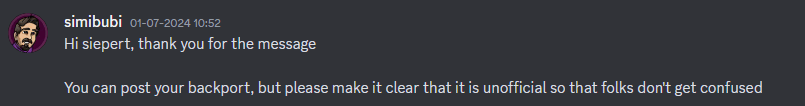

# Create Legacy
[Create Legacy](https://github.com/Siepert123/create-legacy) is an unofficial port of [Create](https://www.curseforge.com/minecraft/mc-mods/create) to [Forge 1.12.2](https://files.minecraftforge.net/net/minecraftforge/forge/index_1.12.2.html).  
[**Download from CurseForge**](https://www.curseforge.com/minecraft/mc-mods/create-legacy) or [**Download from Modrinth**](https://modrinth.com/mod/create-legacy)

For those unfamiliar with Create, it is a mod that's all about technology using cogwheels and other kinetic components to create various machines and automate many processes.

REMEMBER: THIS BACKPORT IS UNOFFICIAL!!!

## What does this mod feature right now?
The mod isn't a backport of a specific create version; it's better to view it as its own separate version, due to some features from older versions being present.
The kinetic networks can only handle one speed per network; we're planning to improve this.
Kinetic blocks now use TESRs! There aren't any Flywheel optimizations, but it should be way better than blockstates.

It is recommended to install [CTM](https://www.curseforge.com/minecraft/mc-mods/ctm) to enjoy epic connected textures.

Oh, and there is [JEI](https://www.curseforge.com/minecraft/mc-mods/jei)/[HEI](https://www.curseforge.com/minecraft/mc-mods/had-enough-items) support!

## Why did you make this?
I'm just a 1.12.2 enjoyer, and noticed the demand for a backport of Create was larger than 2 people.

## Things that will definitely be asked I think
Q: why

A: yes

Q: is this made by simibubi

A: NO!!!!!!!

## Some legal stuff
This mod is **not** affiliated with Simibubi in any way.

_All Java code is written completely from scratch_

Simibubi gave permission for the upload:

## And some other things
There is a [Discord](https://discord.com/invite/WCBecFAyGA) server!
If you need help, or want to suggest something, or vote on polls, that is the place to go.

**All bugs that you find in this mod are _NOT_ to be reported in the official Create server! Report them in the earlier mentioned one instead.**

## Addon making help
Refer to the [wiki](https://github.com/Siepert123/create-legacy/wiki) for help with setup and addons.
